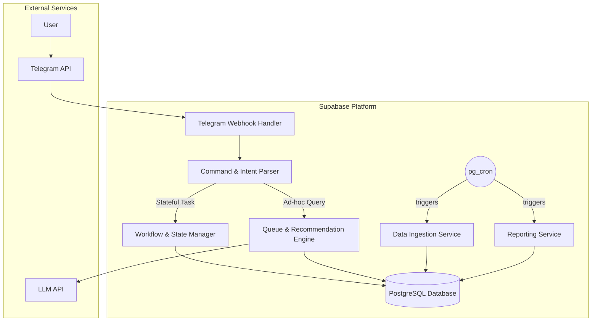

# 5. Component Architecture

## New Components

- **`Telegram Webhook Handler`**: The single, secure entry point for all incoming messages from the Telegram Bot API.
- **`Command & Intent Parser`**: Determines the user's intent from raw text and extracts key entities.
- **`Workflow & State Manager`**: Manages the state of all multi-step conversations, like the post-read reflection.
- **`Data Ingestion & Enrichment Service`**: Handles fetching and enriching book data from external sources.
- **`Queue & Recommendation Engine`**: Contains the core logic for prioritizing the TBR queue and generating recommendations.
- **`Reporting Service`**: Generates and delivers the weekly and monthly insight reports.

## Component Interaction Diagram

