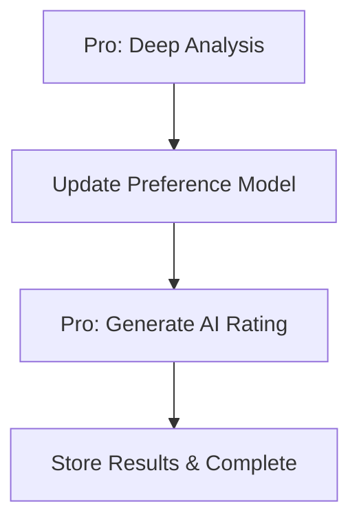

# Story 2.4: AI Ratings & Preference Updates

## Status

Draft

## Story

[Epic Reference: docs/epics/epic-2-ai-intelligence-user-interaction.md - Story 2.4]

**As a** reader who has completed a post-read reflection,
**I want** the system to automatically analyze my reflection and generate an objective AI rating while updating my reading preferences,
**so that** future recommendations become more personalized and accurate based on my actual opinions and reading patterns.

## Acceptance Criteria

1. The workflow is triggered automatically after a user successfully completes a post-read reflection (Story 2.3).
2. The system uses Gemini Pro to analyze the reflection text stored in the `reflections` table.
3. The analysis generates an objective `ai_rating` (0-10) for the book, which is then saved to the `books` table.
4. The system updates the `user_preferences` table based on the analysis to refine the user's taste profile (e.g., adjusting scores for specific genres, authors, or tropes).
5. All database updates are performed within a single transaction to ensure data consistency.
6. The entire analysis and update process is covered by an integration test, mocking the Gemini API call but verifying the database operations.
7. The system gracefully handles potential errors during AI analysis or database updates, logging them via the centralized logger.

## Tasks / Subtasks

- [ ] Task 0: Create database migrations for AI rating and preference updates (AC: 3, 4, 5)
  - [ ] Create migration file: `supabase/migrations/YYYYMMDDHHMMSS_add_rating_analysis_support.sql`
  - [ ] Verify `books.ai_rating` column exists (DECIMAL(3,2), range 0-10)
  - [ ] Verify `reflections.ai_analysis` column exists (JSONB, nullable)
  - [ ] Verify `user_preferences` table exists with schema:
    - id UUID PRIMARY KEY DEFAULT gen_random_uuid()
    - preference_type TEXT NOT NULL (e.g., 'genre', 'author', 'trope', 'pacing', 'tone')
    - preference_value JSONB NOT NULL (flexible structure for different preference types)
    - confidence_score DECIMAL(3,2) (0-1 scale)
    - last_updated TIMESTAMP WITH TIME ZONE DEFAULT now()
  - [ ] Create indexes for performance:
    - `CREATE INDEX idx_user_preferences_type ON user_preferences(preference_type);`
    - `CREATE INDEX idx_user_preferences_updated ON user_preferences(last_updated DESC);`
  - [ ] Test migration runs successfully: `supabase db reset`

- [ ] Task 1: Create reflection analysis Edge Function (AC: 1, 2, 3, 7)
  - [ ] Create new Edge Function: `supabase/functions/analyze-reflection/index.ts`
  - [ ] Set up as Database Webhook handler (triggered by `book_events` inserts where event_type='reflection_completed')
  - [ ] Implement logic to:
    - Extract book_id from event payload
    - Query `reflections` table for the completed reflection content
    - Query `books` table for book metadata (title, author, genres, tropes)
    - Send reflection + metadata to Gemini Pro for analysis
    - Parse AI response to extract:
      - Objective rating (0-10 scale)
      - Preference insights (liked genres, disliked tropes, pacing preferences, etc.)
    - Return structured analysis result
  - [ ] Use shared logger module for structured logging
  - [ ] Use shared error-handler module for error handling
  - [ ] Implement webhook authentication verification
  - [ ] Add environment variable validation (GOOGLE_GEMINI_API_KEY required)

- [ ] Task 1a: Configure Supabase Database Webhook for reflection analysis (AC: 1) - MANUAL SETUP REQUIRED
  - [ ] PAUSE: This task requires manual configuration in Supabase Dashboard
  - [ ] Navigate to Supabase Dashboard → Database → Webhooks
  - [ ] Create new webhook with configuration:
    - Name: `analyze-reflection-webhook`
    - Table: `book_events`
    - Events: INSERT
    - Filter condition: `event_type = 'reflection_completed'`
    - HTTP Request URL: `https://{project_ref}.supabase.co/functions/v1/analyze-reflection`
    - HTTP Headers: `Authorization: Bearer {SUPABASE_ANON_KEY}`, `Content-Type: application/json`
    - HTTP Method: POST
  - [ ] Test webhook delivery by manually inserting a test event into `book_events` table
  - [ ] Verify analyze-reflection function receives webhook payload and logs correctly
  - [ ] CONFIRM: User must complete this task before proceeding with integration tests

- [ ] Task 2: Implement Gemini Pro analysis prompt and response parsing (AC: 2, 3, 4)
  - [ ] Create shared module: `supabase/functions/_shared/rating-analyzer.ts`
  - [ ] Design Gemini Pro prompt template that includes:
    - Book metadata (title, author, genres, tropes, pacing, tone, themes)
    - User reflection text (all 3 Q&A responses)
    - Instructions to analyze sentiment, extract preferences, and generate 0-10 rating
    - Request structured JSON output format
  - [ ] Implement `analyzeReflection()` function:
    - Use Gemini Pro model (`gemini-2.5-pro` or latest)
    - Temperature: 0.3 (balanced between consistency and nuance)
    - Max tokens: 1024
    - Return type: `{ ai_rating: number; preference_updates: PreferenceUpdate[]; analysis_summary: string }`
  - [ ] Define `PreferenceUpdate` interface:
    - preference_type: string (genre, author, trope, pacing, tone, writing_style, etc.)
    - preference_value: Record<string, any> (flexible JSONB structure)
    - adjustment_reason: string (why this preference was inferred)
    - confidence_score: number (0-1)
  - [ ] Implement response parser:
    - Validate rating is 0-10 range
    - Sanitize preference values
    - Handle malformed JSON responses with fallback defaults
  - [ ] Add comprehensive TSDoc comments

- [ ] Task 3: Implement transactional database updates (AC: 3, 4, 5, 7)
  - [ ] Create database service module: `supabase/functions/_shared/preference-updater.ts`
  - [ ] Implement `applyAnalysisResults()` function with Supabase transaction:
    - Begin transaction
    - Update `books` table: SET ai_rating = ? WHERE id = book_id
    - Update `reflections` table: SET ai_analysis = ? WHERE book_id = book_id (store full analysis JSON)
    - For each PreferenceUpdate:
      - UPSERT into `user_preferences` (INSERT or UPDATE based on preference_type)
      - Merge new preference_value with existing (incremental learning pattern)
      - Update confidence_score (weighted average or Bayesian update)
      - Update last_updated timestamp
    - Commit transaction
  - [ ] Implement rollback on any error
  - [ ] Log all database operations with structured logging
  - [ ] Return success/failure status with details

- [ ] Task 4: Integrate analysis pipeline into analyze-reflection Edge Function (AC: 1, 2, 3, 4, 5, 7)
  - [ ] Import rating-analyzer and preference-updater modules
  - [ ] Implement end-to-end workflow in analyze-reflection/index.ts:
    1. Validate webhook payload
    2. Query reflection and book data
    3. Call `analyzeReflection()` with Gemini Pro
    4. Call `applyAnalysisResults()` with transaction
    5. Log success/failure with request ID
    6. Return HTTP 200 on success, appropriate error codes on failure
  - [ ] Add retry logic for transient Gemini API failures (max 3 attempts with exponential backoff)
  - [ ] Implement timeout (30s max for entire workflow)
  - [ ] Send optional Telegram notification on completion (future enhancement, not required for MVP)

- [ ] Task 5: Write unit tests for rating analyzer (AC: 2, 6)
  - [ ] Create test file: `supabase/functions/_shared/rating-analyzer.test.ts`
  - [ ] Test prompt generation with various book metadata combinations
  - [ ] Test response parsing:
    - Valid JSON responses
    - Malformed JSON (missing fields, invalid rating range)
    - Edge cases (empty reflection, very long reflection)
  - [ ] Mock Gemini API calls
  - [ ] Use Deno Test Runner
  - [ ] Verify all tests pass with `deno test`

- [ ] Task 6: Write unit tests for preference updater (AC: 4, 5, 6)
  - [ ] Create test file: `supabase/functions/_shared/preference-updater.test.ts`
  - [ ] Test UPSERT logic:
    - New preference insertion
    - Existing preference update (merge logic)
    - Confidence score updates
  - [ ] Test transaction rollback on error
  - [ ] Mock Supabase client
  - [ ] Use Deno Test Runner
  - [ ] Verify all tests pass with `deno test`

- [ ] Task 7: Write integration test for end-to-end analysis workflow (AC: 6, 7)
  - [ ] Create test file: `supabase/functions/analyze-reflection/analyze-reflection.test.ts`
  - [ ] Test complete workflow:
    1. Create test reflection in `reflections` table
    2. Insert `reflection_completed` event into `book_events`
    3. Mock Gemini Pro API response
    4. Verify `books.ai_rating` updated
    5. Verify `reflections.ai_analysis` populated
    6. Verify `user_preferences` updated with new insights
    7. Verify transaction atomicity (all or nothing)
  - [ ] Test error handling:
    - Gemini API failure → rollback, log error
    - Database connection failure → rollback, log error
    - Invalid reflection data → skip gracefully
  - [ ] Use Deno Test Runner with Supabase test client
  - [ ] Use real Supabase test database, mock only Gemini API
  - [ ] Verify test passes in local environment

## Dev Notes

### IMPORTANT: Context7 MCP for Library Documentation

**CRITICAL INSTRUCTION FOR DEV AGENT:**

When implementing this story, you MUST use the Context7 MCP tools to fetch up-to-date documentation for external libraries, frameworks, and APIs. DO NOT rely solely on story documentation for specific API usage patterns.

**Required Context7 Usage:**

1. **Before using any external library function/API**, call `mcp__context7__resolve-library-id` to get the library ID
2. **Then call** `mcp__context7__get-library-docs` with the library ID and specific topic to get current documentation

**Libraries requiring Context7 lookup in this story:**

- `@langchain/google-genai` - For Gemini Pro model usage, structured output parsing
- `@supabase/supabase-js` - For database transactions, UPSERT patterns, error handling
- `grammy` (grammY Telegram bot framework) - For optional completion notifications (if implemented)

**Example workflow:**

```
// Need to implement Gemini Pro analysis
1. Call: mcp__context7__resolve-library-id("@langchain/google-genai")
2. Call: mcp__context7__get-library-docs(libraryId, topic: "ChatGoogleGenerativeAI Gemini Pro")
3. Implement using current API patterns from Context7 docs
```

**Rationale**: Story Dev Notes provide high-level guidance, but API signatures, parameters, and patterns may have changed. Context7 ensures you use the correct, current implementation patterns.

---

### Previous Story Insights

From Story 2.3 (Post-Read Reflection):

- **Reflection workflow successfully implemented** with LangGraph state machine
  - Reflections stored in `reflections` table with `content` column (NOT `user_reflection`)
  - `book_events` table used for event sourcing (reflection_requested, reflection_completed)
  - PostgreSQL trigger detects `books.status = 'finished'` to start workflow
- **Gemini Flash integration patterns established** [Source: supabase/functions/_shared/gemini-client.ts]
  - Model: `gemini-2.5-flash` (for fast, low-cost tasks)
  - API endpoint: `https://generativelanguage.googleapis.com/v1beta/models/{model}:generateContent`
  - Request structure: `{ contents: [{ parts: [{ text: prompt }] }], generationConfig: {...} }`
  - Response parsing: Extract `data.candidates[0].content.parts[0].text`
  - Error handling: RATE_LIMIT, TIMEOUT, API_ERROR, NETWORK_ERROR taxonomy
- **Database operations use service role** (SUPABASE_SERVICE_ROLE_KEY env var)
- **Shared modules available**:
  - `logger.ts` - Structured logging with request IDs
  - `error-handler.ts` - Centralized error handling
  - `gemini-client.ts` - Gemini Flash integration (extend for Pro)
- **Critical learning**: Database schema must match INSERT statements exactly (Story 2.3 BUG-004: content vs user_reflection column)

---

### AI Orchestration Strategy

**Decision: Use Gemini Pro for Deep Analysis** [Source: docs/architecture/ai-orchestration-architecture.md#AI-Model-Selection]

**Model Selection**:

- **Gemini Pro** (`gemini-2.5-pro` or latest): For reflection analysis (complex reasoning required)
- **Not Gemini Flash**: Flash is optimized for speed, not deep reasoning and preference extraction

**Architecture Pattern** [Source: docs/architecture/ai-orchestration-architecture.md#Post-Read-Reflection-Complex-LangGraph]:

Story 2.3 implemented the first half of the reflection workflow (questions → responses). Story 2.4 implements the second half:



**LangChain Usage Decision** [Source: docs/architecture/ai-orchestration-architecture.md#When-to-Use]:

- **LangChain**: ⚠️ Optional - Batch Gemini calls for analysis; optional LC structured output parsing
- **LangGraph**: ❌ Not required - This is a single-step analysis, not a stateful conversation

**Recommendation**: Start without LangChain. If structured output parsing becomes complex, consider using LangChain's JSON schema validation.

**Performance Guidance** [Source: docs/architecture/ai-orchestration-architecture.md#Performance-Guidance]:

- Cold start target: <3s for analyze-reflection function
- Warm invocation target: <500ms for database updates
- Timeout: 30s max for entire workflow (Gemini Pro calls can be slower than Flash)

**Observability** [Source: docs/architecture/ai-orchestration-architecture.md#Observability]:

- Use structured logging for all AI operations: `logger.info("Gemini Pro analysis", { book_id, reflection_length, analysis_duration_ms })`
- Optionally enable LangSmith tracing for debugging (set LANGCHAIN_TRACING_V2=true in dev environment)

---

### Data Models

**books Table** [Source: docs/architecture/data-models-and-schema-changes.md#books-table]

Relevant fields:

- `id` (UUID): Primary key
- `title` (TEXT): Book title
- `author` (TEXT): Author name
- `genres_primary` (TEXT[]): Primary genres for preference matching
- `genres_secondary` (TEXT[]): Secondary genres
- `tropes` (TEXT[]): Story tropes (enemies-to-lovers, chosen one, etc.)
- `themes` (TEXT[]): Thematic elements
- `pacing` (TEXT): Story pacing (fast-paced, slow-burn, etc.)
- `tone` (TEXT): Overall tone (dark, lighthearted, etc.)
- `writing_style` (TEXT): Author's style characteristics
- `ai_rating` (DECIMAL(3,2)): AI-generated rating **0-10 scale** (CHECK constraint: >= 0 AND <= 10)

**reflections Table** [Source: Story 2.3, supabase/migrations/20250929194922_initial_schema.sql]

Schema:

```sql
CREATE TABLE reflections (
    id UUID PRIMARY KEY DEFAULT gen_random_uuid(),
    book_id UUID REFERENCES books(id) ON DELETE CASCADE,
    content TEXT NOT NULL,  -- Complete reflection (3 Q&A responses)
    reflection_type TEXT CHECK (reflection_type IN ('thought', 'quote', 'question', 'analysis')),
    ai_analysis JSONB,  -- Story 2.4 will populate this
    created_at TIMESTAMP WITH TIME ZONE DEFAULT now()
);
```

**CRITICAL**: Reflections use `content` column (NOT `user_reflection` from migration 20251008000000).

**user_preferences Table** [Source: docs/architecture/data-models-and-schema-changes.md#user_preferences-table]

Schema:

```sql
CREATE TABLE user_preferences (
    id UUID PRIMARY KEY DEFAULT gen_random_uuid(),
    preference_type TEXT NOT NULL,  -- 'genre', 'author', 'trope', 'pacing', 'tone', 'writing_style', etc.
    preference_value JSONB NOT NULL,  -- Flexible structure for different types
    confidence_score DECIMAL(3,2),  -- 0-1 scale
    last_updated TIMESTAMP WITH TIME ZONE DEFAULT now()
);
```

**Preference Value Structures** (Examples):

```json
// Genre preference
{
  "preference_type": "genre",
  "preference_value": {
    "genre_name": "fantasy",
    "affinity_score": 0.85,
    "sample_books": ["book_id_1", "book_id_2"]
  }
}

// Trope preference
{
  "preference_type": "trope",
  "preference_value": {
    "trope_name": "enemies-to-lovers",
    "affinity_score": 0.92,
    "negative": false
  }
}

// Pacing preference
{
  "preference_type": "pacing",
  "preference_value": {
    "preferred_pacing": "fast-paced",
    "tolerance_range": ["medium-paced"]
  }
}
```

**book_events Table** [Source: Story 2.3, supabase/migrations/20251008000000_create_reflection_tables.sql]

Schema:

```sql
CREATE TABLE book_events (
    id UUID PRIMARY KEY DEFAULT gen_random_uuid(),
    book_id UUID REFERENCES books(id) ON DELETE CASCADE,
    event_type TEXT NOT NULL,  -- 'reflection_completed' triggers Story 2.4
    event_data JSONB,  -- Store context: chat_id, timestamp, trigger source
    occurred_at TIMESTAMP WITH TIME ZONE DEFAULT now()
);
```

**Event Types** (relevant to Story 2.4):

- `reflection_completed`: Inserted by Story 2.3 finalize_node, triggers analyze-reflection webhook

---

### Database Trigger Strategy

**Webhook Trigger Pattern** [Source: Story 2.3 implementation]

Story 2.4 follows the same event-driven pattern as Story 2.3:

1. Story 2.3's `finalize_node` inserts `reflection_completed` event into `book_events`
2. Supabase Database Webhook detects INSERT with `event_type = 'reflection_completed'`
3. Webhook calls `analyze-reflection` Edge Function
4. Edge Function processes reflection, updates database

**No PostgreSQL trigger required** - Story 2.3 already creates the `reflection_completed` event via application logic.

---

### Gemini Pro Integration

**Model Configuration** [Source: docs/architecture/external-api-integration.md#Google-Gemini-API]

- **Model**: `gemini-2.5-pro` (or latest Pro model)
- **API Key**: GOOGLE_GEMINI_API_KEY environment variable
- **Endpoint**: `https://generativelanguage.googleapis.com/v1beta/models/gemini-2.5-pro:generateContent?key={API_KEY}`

**Request Structure** (extend gemini-client.ts pattern):

```typescript
{
  contents: [
    {
      parts: [
        {
          text: analysisPrompt  // Include book metadata + reflection
        }
      ]
    }
  ],
  generationConfig: {
    temperature: 0.3,  // Lower than Flash (0.1) but not deterministic
    topK: 40,
    topP: 0.95,
    maxOutputTokens: 1024,
    responseMimeType: "application/json"  // Request structured JSON
  }
}
```

**Structured Output Pattern**:

Request JSON response format in prompt:

```typescript
const prompt = `
Analyze the following book reflection and provide a JSON response:

Book: ${title} by ${author}
Genres: ${genres.join(", ")}
Tropes: ${tropes.join(", ")}
Pacing: ${pacing}
Tone: ${tone}

User Reflection:
${reflectionContent}

Return ONLY valid JSON with this structure:
{
  "ai_rating": <number 0-10>,
  "analysis_summary": "<1-2 sentence summary>",
  "preference_updates": [
    {
      "preference_type": "genre|trope|pacing|tone|author|writing_style",
      "preference_value": { <flexible structure> },
      "adjustment_reason": "<why this preference was inferred>",
      "confidence_score": <0-1>
    }
  ]
}
`;
```

**Response Parsing**:

```typescript
const textContent = data.candidates[0].content.parts[0].text;
const analysis = JSON.parse(textContent);

// Validate rating range
if (analysis.ai_rating < 0 || analysis.ai_rating > 10) {
  throw new Error("Invalid ai_rating: must be 0-10");
}
```

**Error Handling** [Source: supabase/functions/_shared/gemini-client.ts]:

- **Rate limiting** (HTTP 429): Retry with exponential backoff (1s, 2s, 4s)
- **Timeout**: 30s per request
- **Parse errors**: Log error, return default values (rating: 5.0, empty preferences)
- **Network errors**: Retry up to 3 times before failing

---

### Database Transaction Pattern

**Supabase Transaction Usage** [Source: @supabase/supabase-js docs, verify with Context7]

Supabase supports PostgreSQL transactions via RPC or multiple operations in a batch:

**Option 1: RPC Function (Recommended)**

Create PostgreSQL function that wraps all updates:

```sql
CREATE OR REPLACE FUNCTION apply_reflection_analysis(
  p_book_id UUID,
  p_ai_rating DECIMAL(3,2),
  p_ai_analysis JSONB,
  p_preferences JSONB[]
)
RETURNS JSONB AS $$
DECLARE
  result JSONB;
BEGIN
  -- Update books table
  UPDATE books
  SET ai_rating = p_ai_rating
  WHERE id = p_book_id;

  -- Update reflections table
  UPDATE reflections
  SET ai_analysis = p_ai_analysis
  WHERE book_id = p_book_id;

  -- Upsert user_preferences
  FOR i IN 1..array_length(p_preferences, 1) LOOP
    INSERT INTO user_preferences (preference_type, preference_value, confidence_score, last_updated)
    VALUES (
      p_preferences[i]->>'preference_type',
      p_preferences[i]->'preference_value',
      (p_preferences[i]->>'confidence_score')::DECIMAL,
      NOW()
    )
    ON CONFLICT (preference_type)
    DO UPDATE SET
      preference_value = EXCLUDED.preference_value,
      confidence_score = EXCLUDED.confidence_score,
      last_updated = NOW();
  END LOOP;

  result := jsonb_build_object('success', true, 'updated_preferences', array_length(p_preferences, 1));
  RETURN result;
END;
$$ LANGUAGE plpgsql;
```

**Call from Edge Function**:

```typescript
const { data, error } = await supabase.rpc("apply_reflection_analysis", {
  p_book_id: bookId,
  p_ai_rating: analysis.ai_rating,
  p_ai_analysis: analysis,
  p_preferences: analysis.preference_updates,
});
```

**Option 2: Application-Level Transaction** (if RPC not preferred)

Use Supabase client batch operations with error rollback:

```typescript
try {
  // Update books
  const { error: booksError } = await supabase
    .from("books")
    .update({ ai_rating: analysis.ai_rating })
    .eq("id", bookId);

  if (booksError) throw booksError;

  // Update reflections
  const { error: reflectionsError } = await supabase
    .from("reflections")
    .update({ ai_analysis: analysis })
    .eq("book_id", bookId);

  if (reflectionsError) throw reflectionsError;

  // Upsert preferences
  for (const pref of analysis.preference_updates) {
    const { error: prefError } = await supabase.from("user_preferences").upsert({
      preference_type: pref.preference_type,
      preference_value: pref.preference_value,
      confidence_score: pref.confidence_score,
      last_updated: new Date().toISOString(),
    });

    if (prefError) throw prefError;
  }

  logger.info("Analysis applied successfully");
} catch (error) {
  logger.error("Transaction failed, manual rollback required", { error });
  // Note: Supabase client doesn't support native transactions, so rollback is manual
  throw error;
}
```

**Recommendation**: Use **Option 1 (RPC)** for true atomicity. Option 2 lacks native transaction support in Supabase client.

---

### File Locations

Based on established project structure [Source: docs/architecture/source-tree-integration.md]:

**Core Implementation Files**:

- `supabase/migrations/YYYYMMDDHHMMSS_add_rating_analysis_support.sql` - Verify schema for ai_rating, ai_analysis, user_preferences
- `supabase/functions/analyze-reflection/index.ts` - NEW Edge Function for processing reflection_completed events
- `supabase/functions/_shared/rating-analyzer.ts` - NEW service module for Gemini Pro analysis
- `supabase/functions/_shared/preference-updater.ts` - NEW service module for database transaction logic

**Test Files**:

- `supabase/functions/_shared/rating-analyzer.test.ts` - Unit tests for Gemini Pro prompt and parsing
- `supabase/functions/_shared/preference-updater.test.ts` - Unit tests for database transaction logic
- `supabase/functions/analyze-reflection/analyze-reflection.test.ts` - Integration test for end-to-end workflow

**Configuration**:

- `.env` / Supabase secrets: GOOGLE_GEMINI_API_KEY (already configured from Story 2.3)
- `supabase/config.toml`: Register analyze-reflection function

---

### Technical Constraints

**Rating Scale Validation** [Source: docs/architecture/data-models-and-schema-changes.md#books-table]

- **books.ai_rating**: DECIMAL(3,2) with CHECK constraint: `ai_rating >= 0 AND ai_rating <= 10`
- **User ratings**: 1-5 scale (different from AI rating)
- **Confidence scores**: 0-1 scale (DECIMAL(3,2))

**JSONB Flexibility vs Type Safety**:

`user_preferences.preference_value` is JSONB to support various preference structures. No fixed schema enforced at database level.

**Recommendation**: Define TypeScript interfaces for common preference types, but allow flexibility for future preference categories.

**Preference Update Strategy**:

- **New preferences**: INSERT with initial confidence_score
- **Existing preferences**: UPSERT with confidence score adjustment
  - Option 1: Replace (new score overwrites old)
  - Option 2: Weighted average: `new_score = (old_score * old_weight + new_score * new_weight) / (old_weight + new_weight)`
  - Option 3: Bayesian update (more complex)

**Recommendation**: Start with **Option 1 (Replace)** for MVP. Implement incremental learning in future stories.

**Single-User MVP Constraint** [Source: Story 2.3 Dev Notes]:

This is a single-user application. No multi-user concurrency concerns for `user_preferences` table. All preferences belong to the single user.

---

### Security Considerations

**Webhook Endpoint Security**

Analyze-reflection Edge Function must validate incoming webhook requests:

- **Verify source**: Check request comes from Supabase (validate Authorization header matches SUPABASE_ANON_KEY or service role)
- **Payload validation**: Verify webhook payload structure before processing
- **Rate limiting**: Consider implementing rate limiting for webhook endpoint (future enhancement)

**AI Response Validation** [Source: docs/architecture/coding-standards-and-conventions.md#Input-Validation]

Gemini Pro responses must be validated:

- **Rating range check**: Ensure 0-10 (reject if outside range)
- **JSON schema validation**: Verify required fields present (ai_rating, preference_updates)
- **Confidence score validation**: Ensure 0-1 range
- **Sanitize preference values**: Prevent injection attacks in JSONB values

```typescript
function validateAnalysisResponse(analysis: any): boolean {
  if (typeof analysis.ai_rating !== "number") return false;
  if (analysis.ai_rating < 0 || analysis.ai_rating > 10) return false;
  if (!Array.isArray(analysis.preference_updates)) return false;

  for (const pref of analysis.preference_updates) {
    if (!pref.preference_type || !pref.preference_value) return false;
    if (pref.confidence_score < 0 || pref.confidence_score > 1) return false;
  }

  return true;
}
```

**Error Handling Strategy** [Source: docs/architecture/coding-standards-and-conventions.md#Error-Handling]

All errors must use shared error-handler module:

```typescript
import { ErrorContext, handleError } from "../_shared/error-handler.ts";

try {
  // Gemini Pro analysis + database updates
} catch (error) {
  const context: ErrorContext = {
    operation: "analyze_reflection",
    book_id: bookId,
    request_id: requestId,
  };
  return handleError(error, context, logger);
}
```

**Structured Logging Requirements** [Source: docs/architecture/coding-standards-and-conventions.md#Logging-Consistency]

All logs must be JSON-structured with request ID:

```typescript
import { createLogger } from "../_shared/logger.ts";

const logger = createLogger(requestId);
logger.info("Gemini Pro analysis started", {
  operation: "analyze_reflection",
  book_id: bookId,
  reflection_length: reflectionContent.length,
});
```

---

### Testing

**Testing Strategy** [Source: docs/architecture/lean-testing-strategy.md]

**Unit Tests** (Tasks 5-6):

- Framework: Deno Test Runner
- Scope: Gemini Pro prompt generation, response parsing, database transaction logic
- Mock: Gemini API, Supabase client
- Files:
  - `rating-analyzer.test.ts`
  - `preference-updater.test.ts`

**Integration Tests** (Task 7):

- Framework: Deno Test Runner with Supabase test client
- Scope: End-to-end workflow from reflection_completed event → Gemini analysis → database updates
- Mock: Gemini API calls (use test fixtures)
- Use real Supabase test database for transaction validation
- File: `analyze-reflection.test.ts`

**Test Coverage Focus** [Source: docs/architecture/lean-testing-strategy.md#Testing-Philosophy]:

- High confidence in critical user flows (AC 1-7)
- Validate AI rating generation and preference extraction
- Verify database transaction atomicity (all or nothing)
- Test error handling (API failures, database errors)

**CI/CD Integration** [Source: AC 6]:

- Integration test must pass in local environment (CI integration optional for MVP)
- Test runs in parallel with other tests (lint, unit tests)
- Use Supabase test environment (isolated database)

---

### Project Structure Notes

**Edge Function Isolation** [Source: docs/architecture/source-tree-integration.md]

Analyze-reflection is a NEW Edge Function:

- Directory: `supabase/functions/analyze-reflection/`
- Entry point: `index.ts`
- Trigger: Database webhook (book_events table, event_type='reflection_completed')
- Dependencies: Shared modules (_shared/logger, _shared/error-handler, _shared/rating-analyzer, _shared/preference-updater)

**Shared Module Pattern** [Source: docs/architecture/source-tree-integration.md#Key-Integration-Points]:

New shared modules:

1. **rating-analyzer.ts**:
   - Location: `supabase/functions/_shared/rating-analyzer.ts`
   - Exports: `analyzeReflection()`, `PreferenceUpdate` interface
   - Import pattern: `import { analyzeReflection } from "../_shared/rating-analyzer.ts";`

2. **preference-updater.ts**:
   - Location: `supabase/functions/_shared/preference-updater.ts`
   - Exports: `applyAnalysisResults()`, transaction management
   - Import pattern: `import { applyAnalysisResults } from "../_shared/preference-updater.ts";`

**Extend Existing Shared Modules**:

- **gemini-client.ts**: Add Gemini Pro support (currently only has Flash)
  - New function: `analyzeWithGeminiPro()` or similar
  - Reuse error handling patterns from existing `extractBookInfo()`

---

### Coding Standards

**Code Style** [Source: docs/architecture/coding-standards-and-conventions.md]:

- ESLint & Prettier enforced by Husky pre-commit hooks
- TSDoc comments required for all functions, interfaces, and types
- Deno Test Runner for all tests

**Database Integration** [Source: docs/architecture/coding-standards-and-conventions.md#Database-Integration]:

- All database access via Supabase client (no raw SQL in Edge Functions except migrations and RPC functions)
- Use typed queries where possible: `.select<{ id: string; ai_rating: number }>("id, ai_rating")`

**Import Patterns** [Source: docs/architecture/tech-stack-alignment.md]:

- JSR imports for Supabase: `jsr:@supabase/supabase-js@2`
- NPM specifiers for LangChain (if used): `npm:@langchain/google-genai@0.1`
- Tree-shake imports: `import { ChatGoogleGenerativeAI } from "@langchain/google-genai";`

**Environment Variable Validation**:

Always validate required env vars at function startup:

```typescript
const GEMINI_API_KEY = Deno.env.get("GOOGLE_GEMINI_API_KEY");
if (!GEMINI_API_KEY) {
  throw new Error("GOOGLE_GEMINI_API_KEY environment variable not configured");
}
```

---

## Change Log

| Date       | Version | Description            | Author                |
| ---------- | ------- | ---------------------- | --------------------- |
| 2025-10-13 | 1.0     | Initial story creation | Bob (Scrum Master SM) |

## Dev Agent Record

### Agent Model Used

_To be populated by Dev Agent_

### Debug Log References

_To be populated by Dev Agent_

### Completion Notes

_To be populated by Dev Agent_

### File List

_To be populated by Dev Agent_

## QA Results

_To be populated by QA Agent_
