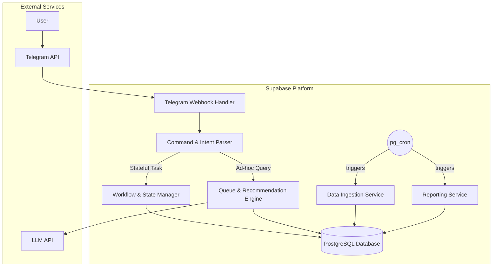

# Shelf Help Assistant - System Architecture

## 1. Introduction

This document outlines the architectural approach for building the **Shelf Help Assistant**. Its primary goal is to serve as the guiding architectural blueprint for development, ensuring we build a system that is reliable, maintainable, and aligned with our goals.

### Project Context Summary

- **Primary Purpose:** To create a personal, learning AI agent that helps the user manage their reading list and gain insights into their habits.
- **Tech Stack:** A Supabase-centric stack using TypeScript, PostgreSQL with `pgvector`, and Edge Functions.
- **Architecture Style:** A serverless, event-driven architecture.
- **Deployment Method:** Automated CI/CD via GitHub Actions.
- **Available Documentation:**
  - A comprehensive and revised Project Brief.
  - A detailed and revised Product Requirements Document (PRD) with a multi-epic roadmap.
- **Identified Constraints:**
  - The system must operate at zero cost.
  - The system is for a single user only.
  - The V1 interface is exclusively a Telegram Bot.

---
## 2. Project Scope and Integration Strategy

### Project Overview
* **Project Type:** New Product Development
* **Scope:** Building the complete Version 1.0 of the **Shelf Help Assistant**, including data ingestion, enrichment, a full AI learning loop, and reporting features.
* **Integration Impact:** Major. This is a full system build.

### Integration Approach
* **Code Integration Strategy:** All backend logic will be implemented as distinct, single-responsibility Supabase Edge Functions using TypeScript. A shared types package will ensure type safety across all functions.
* **Database Integration:** All functions will communicate with the single Postgres database via the official Supabase client library. Direct database access from outside the Supabase ecosystem will be prohibited.
* **API Integration:** The system is primarily driven by two external APIs: the **Telegram Bot API** for user interaction and the **Google Gemini API** for AI capabilities. All external API calls will be made from within Edge Functions.
* **UI Integration:** The Telegram bot is the sole UI. It will interact with the system via a single, secure webhook endpoint managed by the **`grammY` framework**, which then routes to the main orchestration Edge Function.

### Compatibility Requirements
* **Database Schema Compatibility:** The new database schema must be designed to accommodate the data from the initial `classifications.yaml`, `recommendation-sources.yaml`, and the one-time **CSV historical backfill**.
* **UI/UX Consistency:** All bot interactions must align with the personality of an **expert, data-driven assistant** with an **enthusiastic, friendly, and casual tone**, as defined in the PRD.
* **Performance Impact:** All operations must be designed to fit within the Supabase free tier's performance and execution limits.
---

## 3. Tech Stack Alignment

### Approved Foundational Technology Stack

- **Deno is required**: Supabase Edge Functions, which are the core of our backend, are built to run on Deno. It is a required part of the Supabase platform, not an optional tool.
- **Principle**: All technology versions will be pinned to specific numbers (e.g., `v2.5.0`) before development begins to ensure a stable, reproducible build environment.

| Category         | Technology             | Rationale                                             |
| :--------------- | :--------------------- | :---------------------------------------------------- |
| Language         | TypeScript             | The primary language for the project.                 |
| Backend Runtime  | Deno                   | The required runtime for Supabase Edge Functions.     |
| Database         | PostgreSQL w/ pgvector | The core database and vector extension from Supabase. |
| AI Orchestration | LangChain + LangGraph  | The frameworks for building the AI logic.             |
| Scheduling       | pg\_cron               | The native cron job scheduler in Supabase.            |

### New Technology Additions (External Dependencies)

| Technology        | Purpose                                               |
| :---------------- | :---------------------------------------------------- |
| Telegram Bot API  | The API for the primary user interface.               |
| Google Gemini API | The API for natural language generation and analysis. |

### Development, Testing, and Deployment Tooling

| Category          | Technology            | Rationale                                                        |
| :---------------- | :-------------------- | :--------------------------------------------------------------- |
| Node.js Runtime   | Node.js LTS           | Required for the ecosystem of development tools like npm.        |
| Package Manager   | npm                   | For managing development tool dependencies.                      |
| Code Quality      | ESLint & Prettier     | Enforces consistent code style and prevents common errors.       |
| **Git Hooks**     | **Husky**             | **Automates local quality checks before commits and pushes.**    |
| **Bot Framework** | **grammY**            | **Simplifies interaction with the Telegram Bot API.**            |
| Testing           | Deno Test Runner      | The native, built-in solution for testing Deno applications.     |
| CI/CD             | GitHub Actions        | Native integration for deploying to Supabase.                    |
| Local Environment | Supabase CLI & Docker | Essential for emulating the full production environment locally. |
| Version Control   | Git                   | For source code management.                                      |

---
## 4. Data Models and Schema Changes

### `books` Table (Final Version)
* **Core Identifiers**: `id`, `goodreads_id`, `isbn`, `created_at`
* **Bibliographic Data**: `title`, `author`, `page_count`, `publisher`, `publication_date`, `series_name`, `series_number`, `cover_image_url`, `goodreads_link`
* **User Data (from Goodreads RSS)**: `user_shelves`, `user_rating`, `user_date_added`, `user_date_finished`
* **Classification & Thematic Data (Enriched)**: `genres_primary`, `genres_secondary`, `tropes`, `themes`, `keywords`, `target_audience`
* **Stylistic & Structural Data (Enriched)**: `pacing`, `tone`, `writing_style`, `pov_type`, `pov_gender`, `spice_level`
* **System & AI-Generated Data**: `status`, `queue_position`, `availability`, `hype_flag`, `ai_summary`, `ai_rating`, `embedding`

### Other Tables
* `reflections`
* `user_preferences`
* `conversational_state`
* `book_events`
---

## 5. Component Architecture

### New Components

- **`Telegram Webhook Handler`**: The single, secure entry point for all incoming messages from the Telegram Bot API.
- **`Command & Intent Parser`**: Determines the user's intent from raw text and extracts key entities.
- **`Workflow & State Manager`**: Manages the state of all multi-step conversations, like the post-read reflection.
- **`Data Ingestion & Enrichment Service`**: Handles fetching and enriching book data from external sources.
- **`Queue & Recommendation Engine`**: Contains the core logic for prioritizing the TBR queue and generating recommendations.
- **`Reporting Service`**: Generates and delivers the weekly and monthly insight reports.

### Component Interaction Diagram



## 6. API Design and Integration

### API Integration Strategy

- The system will expose a single, primary API endpoint to be used as a webhook by the Telegram Bot API.
- The webhook will be secured by validating a secret token sent in the `X-Telegram-Bot-Api-Secret-Token` HTTP header.
- The API will be versioned as `v1` in its URL path.

### New API Endpoints

- **Endpoint:** `POST /api/v1/telegram-webhook`

---
## 7. AI Orchestration Architecture

### LangChain + LangGraph Integration Strategy
The AI system leverages **LangChain** for LLM integration and **LangGraph** for complex, stateful AI workflows. This provides a modular design where complex tasks like post-read reflection are managed as state machines.

### AI Model Selection Strategy
* **Gemini 1.5 Flash Usage**: For quick, low-cost tasks like intent classification, simple recommendations, and basic data extraction.
* **Gemini 1.5 Pro Usage**: For complex, high-reasoning tasks like post-read reflection analysis, metadata enrichment, and detailed report generation.

### AI Workflow Examples
#### Mood-Based Recommendation (Simple)
```mermaid
graph LR
    A[User: "I want something uplifting"] --> B[Flash: Intent Detection]
    B --> C[Vector Search: Books DB]
    C --> D[Flash: Generate Recommendation]
    D --> E[Response to User]
```

#### Post-Read Reflection (Complex LangGraph)
```mermaid
graph TD
    A[User: "Finished reading X"] --> B[Start Reflection Workflow]
    B --> C[Flash: Generate Initial Questions]
    C --> D[Gather User Responses]
    D --> E{More Questions?}
    E -->|Yes| C
    E -->|No| F[Pro: Deep Analysis]
    F --> G[Update Preference Model]
    G --> H[Pro: Generate AI Rating]
    H --> I[Store Results & Complete]
```

## 8. External API Integration

### Telegram Bot API
* **Purpose:** To handle all user-facing communication.
* **Documentation:** [https://core.telegram.org/bots/api](https://core.telegram.org/bots/api)
* **Integration Method:** Receive data via a single webhook managed by `grammY`; send data via outbound REST API calls.

### Google Gemini API
* **Purpose:** To provide natural language understanding and generation.
* **Documentation:** [https://ai.google.dev/docs](https://ai.google.dev/docs)
* **Integration Method:** Outbound REST API calls via LangChain integration from Supabase Edge Functions.
---

## 9. Source Tree Integration

The final source tree structure will be determined during the initial development phase of Epic 1. The goal is to allow a natural, simple structure to emerge from the code itself, rather than prescribing a potentially over-engineered structure upfront. This aligns with the project's principle of maintainability and simplicity for a solo developer.

---
## 10. Simplified Development and Deployment Workflow

This section outlines the pragmatic, low-friction development and deployment process for this project.

### Guiding Principles
* **Solo-Developer Productivity:** The workflow is optimized for a single developer to minimize time spent debugging the process.
* **Lean & Effective:** We will use the simplest tools and checks necessary to ensure code quality without introducing enterprise-grade complexity.
* **"Shift-Left" Quality:** As many quality checks as possible will be automated to run on the local machine *before* code is pushed.

### Local Development Workflow
The primary line of defense for code quality will happen locally, managed by **Husky**:
1.  **On `git commit`**: **Prettier** and **ESLint** will automatically run to catch formatting and linting errors.
2.  **On `git push`**: A quick suite of critical unit tests will run using the **Deno Test Runner** to catch functional bugs.

### Simplified CI/CD Pipeline (GitHub Actions)
1.  **Trigger**: The pipeline runs automatically when a Pull Request is opened or updated.
2.  **Validation**: It runs the **full test suite** (unit and integration tests) using the Deno Test Runner.
3.  **Deployment**: Upon merging a Pull Request to the `main` branch, the pipeline will automatically deploy the updated Supabase Edge Functions.

### Rollback Strategy
* **Rollback Method:** Problematic deployments will be rolled back by reverting the corresponding commit in Git, which automatically triggers a re-deployment of the previous stable version.
---

## 11. Coding Standards and Conventions

### Existing Standards Compliance

- **Code Style:** Enforced by ESLint & Prettier.
- **Linting Rules:** A strict ESLint configuration will be used.
- **Testing Patterns:** All new code will be accompanied by tests written with the Deno Test Runner.
- **Documentation Style:** All functions and complex types will be documented using TSDoc comments.

### Critical Integration Rules

- **Database Integration:** All database access must go through the Supabase client.
- **Error Handling:** A standardized error handling and logging framework will be used (to be defined during implementation).
- **Logging Consistency:** All logs should be structured (JSON) and include a request ID.

---
## 12. Lean Testing Strategy

### Testing Philosophy: Confidence Over Coverage
The primary goal of our testing strategy is to provide **high confidence** in the application's core functionality with the **minimum number of tests**. We will not chase arbitrary code coverage metrics. For a personal, single-user tool, the focus is on preventing critical, user-facing bugs, not on building an enterprise-grade test suite. The strategy is designed to be low-friction and developer-friendly.

### The Testing Pyramid (Simplified)
1.  **Unit Tests (A Small, Solid Base):**
    * **Framework:** Deno Test Runner.
    * **Scope:** Written **only** for critical, isolated business logic (e.g., scoring algorithms, complex data transformations).
2.  **Integration Tests (A Few, High-Value Tests):**
    * **Framework:** Deno Test Runner.
    * **Scope:** Validate that the most critical, end-to-end user flows work correctly, ensuring the main components (`grammY`, `LangChain`, `Supabase` database) are properly connected.

### What We Are Explicitly NOT Doing
* **No Automated E2E Testing:** For a single-user Telegram bot, manual testing of user flows in the app is sufficient and more cost-effective.
* **No Strict Naming Conventions:** Test files will be named logically but will not follow complex naming schemes.
---
